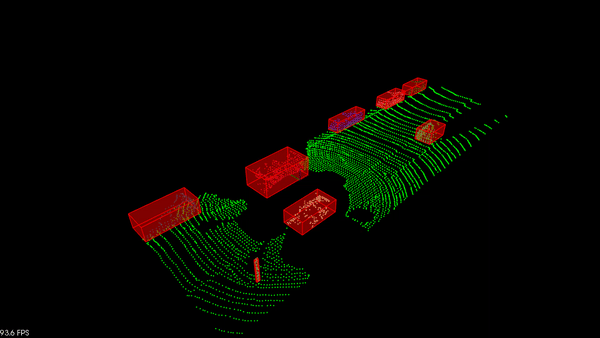

# SFND-Lidar-Project

This is the final submission for the SFND Lidar project.
The main source has been cloned from the udacity relative repository (https://github.com/udacity/SFND_Lidar_Obstacle_Detection.git) and later the requested functions have been implemented locally.

In order to compile it Eigen3 and pcl libraries are required.



Commands for compiling:

```rm -r build/```  

```mkdir build```  

```cd build/```

```cmake ..```  

```make```  

Testing:  

```./environment```  
